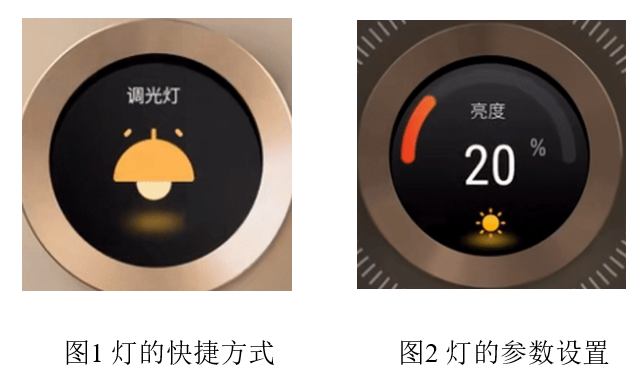
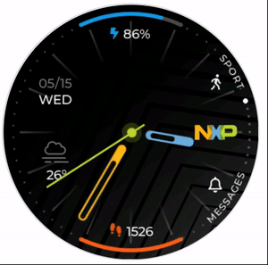
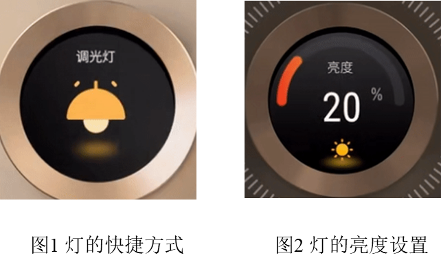
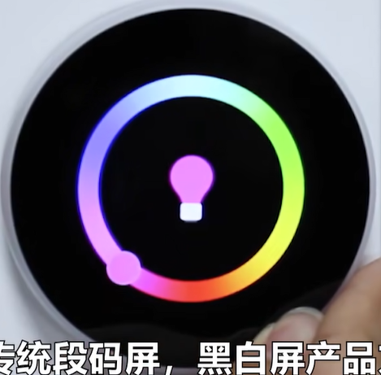
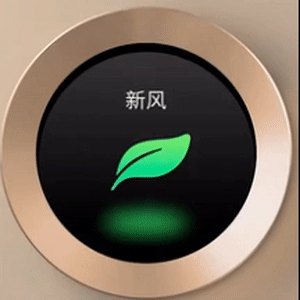
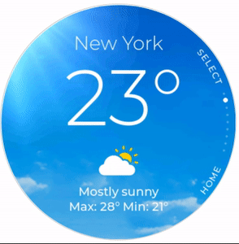
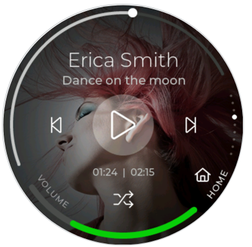
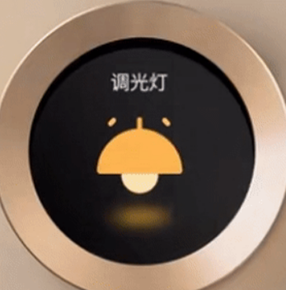
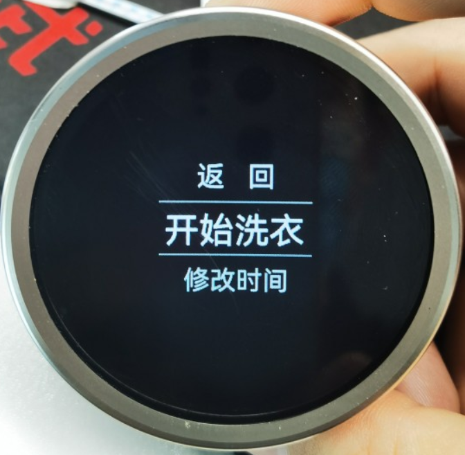
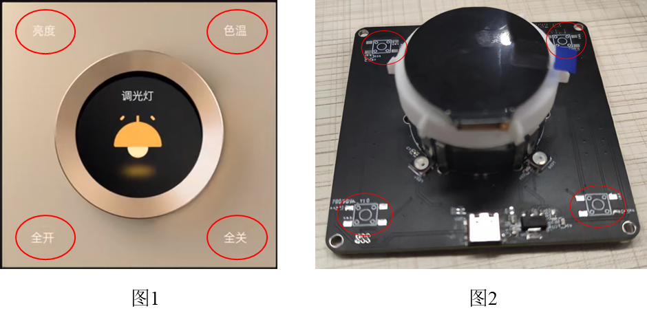

# UI 设计

分辨率：圆屏 240*240

## 主界面

主界面用于显示各个 APP 的**快捷方式**，如下图 1 所示，主界面整体风格也如图 1 所示。

通过快捷方式来进入 APP 的**详细界面**，如下图 2 所示，APP 整体风格也如图 2 所示。

### APP 切换

在主界面下，通过旋转旋钮可以在各个 APP 快捷方式间切换。

- 切换风格如下图 1 所示，切换顺序为**上下环形**切换，**所有 APP 快捷方式的右侧显示所在位置（白点）**
- 切换动画如下图 2 所示，应为**上下连贯**的切换效果

### APP 进入/退出

在主界面下，通过按压旋钮来控制 APP 的进入和退出，**控制方式**如图 1 所示，**动画**如图 2 所示。

- 在主界面中某 APP 的快捷方式处，**短按松开**后即进入该 APP 的详细界面
- 在 APP 中任意位置，**长按**后即退出该 APP 的详细界面，并回到主界面中该 APP 的快捷方式处

## APP 

### 时钟

该 APP 为主界面**默认显示**的 APP，用于显示**日期**和**时间**，可参考下图。

- 没有详细界面，即按压旋钮没有操作
- 显示元素包含如下：
  - 符合主界面风格的表盘
  - 分别代表”时-分-秒“的三根指针
  - 显示日期的”月-日-星期“

### 灯

该 APP 用于控制灯的色彩、亮度、饱和度。

- UI 主要包含主界面下的**快捷方式**， 详细界面下的**亮度控制**、**色彩控制**和**饱和度控制**
- 进入**详细界面**后，短按旋钮可在三个子界面之前切换

- 其快捷方式可参考下图 1，亮度和饱和度控制界面可参考下图 2

- 其色彩控制界面可参考下图：

 

### 风扇

该 APP 用于控制风扇转速，UI 可参考下图。

### 天气

该 APP 用于显示简单的天气信息，UI 可参考下图。

- 没有详细界面，即按压旋钮没有操作

- 界面元素包括：城市、气温（当前、最小及最大）、天气状况（文本、图标及背景）
- 预设 3 个城市的天气信息，**短按**旋钮来切换城市
- wifi 连接后实时更新

### 音乐播放器

该 APP 用于播放音乐，UI 可参考下图。

- 界面元素包括：进度条、音量设置、上一首/下一首/暂停&播放/模式（随机、顺序）、背景图片
- 没有详细界面，但短按旋钮会进入元素选择模式；旋转旋钮可以在各个界面元素之间切换，再次短按会触发选中/取消选中元素，选中后旋转旋钮用于控制元素增减；任意时刻长按旋钮会退出该模式

### 设置

该 APP 用于设置和查看系统参数。

- 快捷方式可参考下图灯的 UI 风格

- 详细界面可参考下图，主要包含以下几项：
  - 关于：用于显示芯片型号、内存等信息
  - wifi 状态：显示 wifi 名称、强度、ip等信息
  - wifi 连接：实现二维码配网

# 其他设计

## 四角按键

位于底板的四个角上，如下图 2 所示，四个按键像图 1 一样具有特定的功能：

- 按键 1：快速进入”**灯**“ APP 的详细界面
- 按键 2：快速进入 ”**风扇**“ APP 的详细界面
- 按键 3：快速进入 ”**设置**“ APP 的详细界面
- 按键 4：快速回到主界面的默认 APP（时钟）
- 在任意界面均可响应上述功能

## 氛围灯

位于旋钮的四周，如图 2 所示，像图 1 一样会对旋钮按下等操作进行变色

- 在”灯“ APP 的设置界面，会跟随设置的颜色同步进行变化
- 短按旋钮，闪烁绿灯
- 长按旋钮，闪烁红灯

